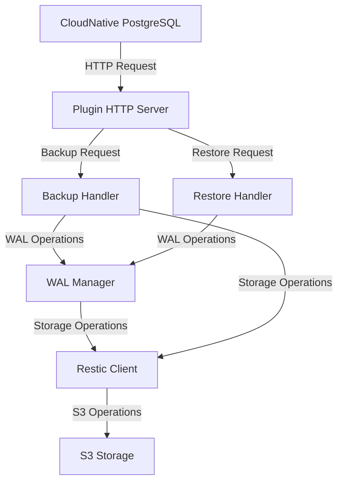

# Architecture Overview

This document describes the high-level architecture of the CloudNative PostgreSQL Restic Backup Plugin.

## System Components

## Core Components

### Plugin HTTP Server
- Entry point for CloudNative PostgreSQL operator interactions
- Handles HTTP requests for backup, restore, and WAL operations
- Routes requests to appropriate handlers
- Validates request payloads
- Reports operation status back to the operator

### Backup Handler
- Manages full database backup operations
- Handles WAL archiving through the WAL Manager
- Maintains backup metadata
- Ensures backup consistency

### Restore Handler
- Manages backup restoration operations
- Handles WAL restoration for PITR
- Coordinates with WAL Manager for WAL segment retrieval
- Ensures data consistency during restore

### WAL Manager
- Handles WAL segment operations
- Manages WAL timelines
- Tracks WAL segments
- Implements cleanup policies
- Ensures WAL continuity for PITR

### Restic Client
- Interfaces with Restic backup system
- Manages repository operations
- Handles S3 storage interactions
- Maintains backup snapshots

## Data Flow

### Backup Flow
1. CloudNative PostgreSQL initiates backup request
2. Plugin receives HTTP request
3. Backup Handler creates consistent backup
4. WAL Manager archives WAL segments
5. Restic Client stores data in S3
6. Status returned to operator

### Restore Flow
1. CloudNative PostgreSQL initiates restore request
2. Plugin receives HTTP request
3. Restore Handler retrieves backup
4. WAL Manager restores required WAL segments
5. Data restored to specified location
6. Status returned to operator

### WAL Archiving Flow
1. PostgreSQL calls WAL archive command
2. Plugin receives archive request
3. WAL Manager processes segment
4. Restic Client stores in S3
5. Status returned to PostgreSQL

## Security

### Authentication
- S3 credentials management
- Secure configuration handling
- Environment variable based secrets

### Authorization
- Plugin-to-storage authorization
- Operator-to-plugin authorization

## Monitoring

### Logging
- Structured logging throughout components
- Operation tracking
- Error reporting
- Performance metrics

### Health Checks
- Repository connectivity
- S3 availability
- System health status

## Configuration

### Plugin Configuration
- HTTP server settings
- Log levels and formats
- Operation timeouts

### Backup Configuration
- Retention policies
- Compression settings
- Backup schedules

### WAL Configuration
- Segment retention
- Timeline management
- Cleanup policies
